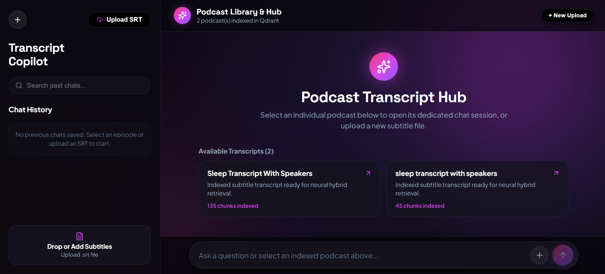
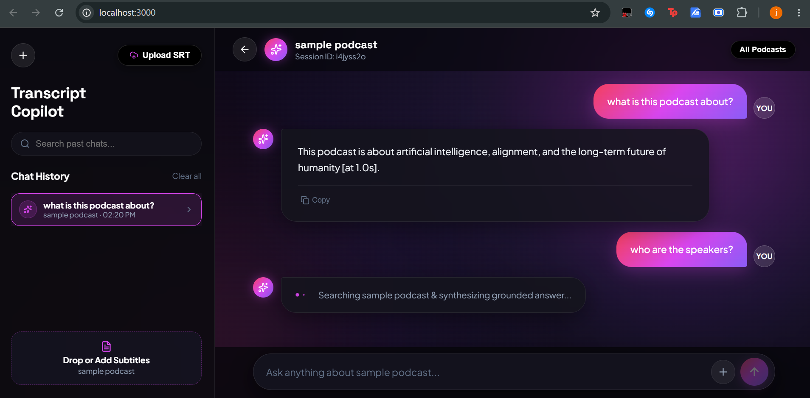
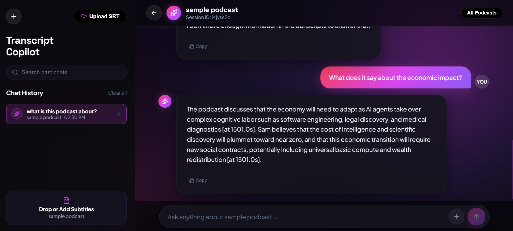

# Podcast Transcript RAG System

A stateful Retrieval-Augmented Generation (RAG) system implementing production patterns for timestamped podcast transcripts and subtitle files (`.srt`). Features hybrid retrieval (dense + BM25), Cross-Encoder neural reranking, LangGraph-driven Corrective RAG (CRAG) self-correction, deterministic zero-token guardrails, multi-provider LLM failover, and automated evaluation.

Built with **Python**, **FastAPI**, **LangChain**, **LangGraph**, **Qdrant**, **SentenceTransformers**, and a decoupled **React 19 + Vite** frontend.

---

## System Architecture

```
                                QUERY FLOW
                        ─────────────────────────

        User Query
            │
            ▼
   ┌─────────────────────┐
   │   Input Guardrail   │  Zero-token deterministic regex validation (<1ms)
   │  (guardrails.py)    │  Blocks prompt injection, jailbreaks, and leaks
   └────────┬────────────┘
            │ Safe
            ▼
   ┌─────────────────────┐
   │   LangGraph Router  │  Classifies query: requires fresh transcript search
   │    (graph.py)       │  vs answers from conversation history (stateful)
   └────────┬────────────┘
            │ "search"
            ▼
   ┌─────────────────────┐      ┌─────────────────────┐
   │   Dense Retrieval   │      │   Sparse Retrieval   │
   │ (Qdrant + MiniLM)   │      │ (Qdrant + FastEmbed)│
   └────────┬────────────┘      └────────┬─────────────┘
            │ Top-20                     │ Top-20
            └────────────┬───────────────┘
                         ▼
            ┌────────────────────────┐
            │  Reciprocal Rank       │  RRF(d) = Sum[ 1/(60+rank) ]
            │  Fusion (RRF)          │  Merges dense & sparse candidate pools
            └────────────┬───────────┘
                         │ Top-20 Fused
                         ▼
            ┌────────────────────────┐
            │  Cross-Encoder         │  ms-marco-MiniLM-L-6-v2
            │  Neural Reranker       │  Joint query-document cross-attention
            └────────────┬───────────┘
                         │ Top-5 Verified
                         ▼
            ┌────────────────────────┐
            │  CRAG Confidence Gate  │  Top rerank score < 0.0?
            │  (Self-Correction)     │  → Rewrite query via LLM
            │                        │  → Re-retrieve (bounded loop, max 2)
            └────────────┬───────────┘
                         │ Confident
                         ▼
            ┌────────────────────────┐
            │  LLM Generation        │  Primary: Gemini 3.7 Flash
            │  with Fallback Chain   │  Failover: Groq (openai/gpt-oss-120b)
            │  + Grounded Prompt     │  Strict timestamp citations, temp=0.0
            └────────────────────────┘
```

### Ingestion Pipeline

```
  Raw .srt File → TranscriptParser (regex) → PodcastChunker (segment-aware overlap)
       → Dense Embeddings (all-MiniLM-L6-v2, 384-dim)
       → Sparse Embeddings (Qdrant BM25)
       → Unified Qdrant Collection (dense + sparse vectors + rich metadata payload)
```

---

## Core Engineering Decisions

**1. Why Hybrid Search (Dense + Sparse) instead of Dense-Only?**
- Dense embeddings (`all-MiniLM-L6-v2`) capture high-level semantic meaning and paraphrases (e.g., *"techniques for ensuring models align"*), but can miss exact acronyms and proper nouns.
- Sparse embeddings (BM25) ensure exact term matches (e.g., *"RLHF"*, specific names, quotes) are never dropped.
- **Reciprocal Rank Fusion (RRF)** merges candidate lists using ordinal rank positions rather than incomparable raw similarity scores:
  $$\text{RRF}(d) = \sum_{m \in \{\text{Dense}, \text{Sparse}\}} \frac{1}{60 + \text{rank}_m(d)}$$

**2. Why Cross-Encoder Reranking after RRF?**
- Bi-Encoders compute query and document representations independently for fast vector index lookup.
- Cross-Encoders (`ms-marco-MiniLM-L-6-v2`) process query-document pairs simultaneously with full cross-attention, capturing complex semantic nuance.
- *Tradeoff handled:* Cross-Encoders cannot pre-compute vectors, so they are selectively applied only to the top-20 RRF candidate pool, adding only ~150ms of latency while significantly boosting precision.

**3. Why Corrective RAG (CRAG) Self-Correction?**
- When retrieval returns low-confidence context (top rerank score $< 0.0$), the system triggers an autonomous query rewriting node that resolves vague queries (*"Is it enough?"*) into expanded keyword searches.
- A state-tracked loop counter caps rewrites at 2 cycles to prevent infinite execution loops.

**4. Why Multi-Provider LLM Orchestration with Fallback?**
- Chained with LangChain's `.with_fallbacks()`: Google Gemini serves as primary (`gemini-2.5-flash`), with automatic zero-downtime failover to Groq (`openai/gpt-oss-120b`) if rate limits (HTTP 429) or service outages (5xx) occur.

**5. Why Zero-Token Deterministic Guardrails?**
- Rather than burning LLM tokens and adding 1-2s of round-trip latency to classify inputs, pre-execution regex guardrails catch prompt injections, system prompt leak attempts, and jailbreak signatures in `< 1ms` at zero cost.

---

## User Interface & Interactive Capabilities

The decoupled React 19 single-page application provides a dark obsidian glassmorphic workspace tailored for timestamped transcript exploration, multi-turn dialogue, and instant SRT file indexing.

### 1. Multi-Transcript Library & Hub

*Figure 1: **Central Podcast Library Hub** — Displays all indexed subtitle transcripts with live chunk counts in Qdrant, a drag-and-drop ingestion zone, and searchable multi-session conversation history in the sidebar.*

---

### 2. Grounded Dialogue Synthesis & Exact Timestamp Citations

*Figure 2: **Factual Grounding & Multi-Turn State** — User queries the core theme (`"what is this podcast about?"`), and the agent synthesizes an accurate summary strictly cited to the transcript (`[at 1.0s]`). The follow-up query (`"who are the speakers?"`) demonstrates conversational memory and real-time retrieval status feedback.*

---

### 3. Strict Out-of-Domain Refusal & Deep Semantic Extraction

*Figure 3: **Refusal Boundary & Long-Horizon Synthesis** — Top: When queried on topics absent from the transcript, the agent enforces strict grounding and refuses (*"I don't have enough information in the transcripts to answer that"*). Bottom: When asked about complex economic impacts, the agent accurately extracts multi-speaker arguments with deep timestamp citations (`[at 1501.0s]` $\approx 25\text{m }01\text{s}$).*

---

## Evaluation Benchmark & Diagnostic Results

The system was evaluated against an automated **32-question golden dataset** covering 12 distinct query categories. Full report available in [`eval/EVAL_REPORT.md`](eval/EVAL_REPORT.md).

### Summary KPI Metrics

| Metric | Result | Target | Notes |
| :--- | :---: | :---: | :--- |
| **Mean Faithfulness (Grounding)** | **0.928** | $\ge 0.85$ | Evaluated via LLM-as-a-judge; measures context adherence |
| **Out-of-Scope Refusal Rate** | **87.5%** (7/8) | $\ge 80\%$ | System correctly says *"I don't have enough information"* when answers are absent |
| **Guardrail Interception Rate** | **100%** | $100\%$ | Blocked prompt injections deterministically ($n=9$ known attack patterns; regex does not generalize to novel zero-day injections) |
| **Mean End-to-End Latency** | **4.84s** | $< 6.0\text{s}$ | Fast-path single-pass queries average ~3.2s; CRAG rewrite loops average ~6.8s (see Latency Optimization Path below) |

### Honest Diagnostic Findings (Where the System Breaks)

* **Speaker Intent & Tone Inference Failure (`speaker_identification`: 0.50 faithfulness, $n=2$):**
  On query #30 (*"Did Lex express skepticism about RLHF solving alignment?"*), the ground truth labeled Lex's question as expressing skepticism, but the system answered *"No, Lex neutrally asked if it was enough without voicing personal skepticism."* The system was wrong here — it missed implied conversational tone because it strictly grounds on explicit literal statements. This is a real architectural boundary of literal RAG: single-pass transcript retrieval cannot reliably infer speaker subtext or unstated intent. Two mitigation paths exist: (1) accept this as an explicit scope boundary (strict factual verification only), or (2) add a secondary inference-tolerant analysis pass specifically for sentiment and dialogue tone when tone-probing questions are detected.
* **Answer Relevancy Metric Artifact (1.0000 across all 32 items):**
  Investigation revealed that standard relevancy judge prompts test topical on-topic alignment rather than factual precision. Both a grounded answer and a correct refusal are deemed "on-topic." In our evaluation report, this metric is transparently documented as non-discriminating rather than cited as false evidence of perfection.

### Latency Analysis & Optimization Path

While standard single-pass queries complete in ~3.2s, queries triggering the CRAG rewrite loop average 6.1s–6.8s due to sequential LLM invocations (initial retrieval grading $\rightarrow$ query expansion LLM $\rightarrow$ re-retrieval $\rightarrow$ final generation). In a production environment, this latency would be reduced by:
- **Token Streaming (Server-Sent Events / WebSockets):** Reduces perceived user latency by cutting Time-to-First-Token (TTFT) to $< 800\text{ms}$.
- **Low-Latency Rewrite Model:** Routing the query rewrite node to a lightweight 8B model on Groq (~180ms) rather than Gemini.
- **Semantic Query Cache:** Caching rewritten query vectors to eliminate redundant expansions for common rephrasings.

---

## Project Structure

```
podcast_rag/
├── app/
│   ├── main.py                 # FastAPI REST API, lifespan pre-warming, CORS, ThreadPoolExecutor
│   ├── config.py               # Pydantic BaseSettings with environment validation
│   ├── models/
│   │   └── schemas.py          # Pydantic schemas (QueryRequest, IngestRequest, Chunk, etc.)
│   └── rag/
│       ├── parser.py           # SRT/TXT regex parser with timestamp & speaker extraction
│       ├── chunker.py          # Segment-aware sliding window chunker (500 char, 80 char overlap)
│       ├── store.py            # Unified Qdrant hybrid vector store (dense + sparse BM25)
│       ├── retriever.py        # Hybrid RRF fusion + Cross-Encoder reranker
│       ├── engine.py           # RAGEngine facade: LangChain Gemini→Groq fallback orchestration
│       ├── graph.py            # LangGraph stateful CRAG workflow (router, retrieve, rewrite, generate)
│       └── guardrails.py       # Zero-token deterministic prompt injection & jailbreak guardrail
├── eval/
│   ├── dataset.json            # 32-item golden dataset (12 query categories)
│   ├── evaluate.py             # Automated LLM-as-a-judge evaluation harness
│   ├── eval_results.csv        # Detailed per-query scores and telemetry
│   └── EVAL_REPORT.md          # Diagnostic evaluation report
├── frontend/                   # Decoupled React 19 + Vite SPA (instant <100ms load)
│   ├── src/
│   │   ├── App.jsx             # Conversational UI, SRT drag-and-drop, telemetry badges
│   │   ├── index.css           # Dark emerald glassmorphism design system (no emojis)
│   │   └── main.jsx
│   ├── package.json
│   └── vite.config.js
├── tests/
│   ├── test_guardrails.py      # Adversarial injection & jailbreak unit tests
│   ├── test_langgraph.py       # Multi-turn conversation & routing tests
│   ├── test_pipeline.py        # End-to-end ingestion & retrieval tests
│   └── test_qdrant.py          # Vector store hybrid search tests
├── data/
│   └── sample_podcast.srt      # Sample transcript for testing and demo
└── requirements.txt
```

---

## Tech Stack & Competencies

| Layer | Technology | Engineering Role |
| :--- | :--- | :--- |
| **Backend API** | FastAPI + Uvicorn | Async web service with lifespan model loading and `ThreadPoolExecutor` for CPU-bound PyTorch math |
| **Agent / Orchestration** | LangGraph + LangChain | Stateful multi-turn CRAG workflow with `MemorySaver` checkpointer and router |
| **Vector Database** | Qdrant | Hybrid search (dense cosine + sparse BM25) in a single collection with payload filtering |
| **Embeddings** | SentenceTransformers (`all-MiniLM-L6-v2`) | 384-dimensional dense semantic vectors (CPU-optimized) |
| **Sparse Index** | FastEmbed (`Qdrant/bm25`) | Exact keyword and acronym matching |
| **Neural Reranker** | Cross-Encoder (`ms-marco-MiniLM-L-6-v2`) | Full cross-attention query-chunk verification |
| **Primary LLM** | Google Gemini 3.7 Flash | Temperature=0.0 grounded generation with timestamp citations |
| **Fallback LLM** | Groq (`openai/gpt-oss-120b`) | Zero-downtime automatic failover via LangChain |
| **Input Guardrails** | Custom Regex Engine | Sub-millisecond deterministic prompt injection interceptor |
| **Frontend** | React 19 + Vite | Decoupled client with instant initial load, dark aurora glassmorphism, and Lucide vector icons |
| **Validation** | Pydantic v2 | Strict data contracts across all layers |

---

## Quickstart

### Prerequisites

- Python 3.11+
- Node.js 18+ (for frontend)
- API key for Gemini and/or Groq

### 1. Environment Setup

```bash
# Clone repository
git clone https://github.com/your-username/podcast-transcript-rag.git
cd podcast-transcript-rag

# Create virtual environment
python -m venv venv
source venv/bin/activate       # Linux/macOS
.\venv\Scripts\Activate.ps1    # Windows PowerShell

# Install Python dependencies
pip install -r requirements.txt
```

### 2. Configure Environment Variables

Create `.env` in the root directory:

```env
GEMINI_API_KEY=your_gemini_api_key_here
GROQ_API_KEY=your_groq_api_key_here
RAG_PERSIST_DIR=./data
```

### 3. Start the FastAPI Backend

```bash
uvicorn app.main:app --port 8000
```

- **Interactive API Docs (Swagger):** [http://127.0.0.1:8000/docs](http://127.0.0.1:8000/docs)
- **Health / Status Endpoint:** [http://127.0.0.1:8000/status](http://127.0.0.1:8000/status)

### 4. Start the React Frontend

```bash
cd frontend
npm install
npm run dev
```

- **Interactive Web Application:** [http://localhost:3000](http://localhost:3000)

---

## API Endpoints

### `POST /chat` — Conversational Query
```json
{
  "query": "What does Sam say about RLHF and automated alignment?",
  "thread_id": "session_123",
  "podcast_name": "Lex Fridman Podcast"
}
```
**Response (`200 OK`):**
```json
{
  "query": "What does Sam say about RLHF and automated alignment?",
  "answer": "Sam says that RLHF is a valuable first step toward solving AI alignment, but it isn't a silver bullet. He emphasizes that scalable, automated alignment techniques will be necessary as models become superintelligent [at 16.0s].",
  "thread_id": "session_123"
}
```

### `POST /upload` — Multipart File Ingestion
Uploads a subtitle (`.srt`) file, automatically parses timestamps and speakers, chunks the transcript with segment overlap, computes embeddings, and indexes chunks into Qdrant.

### `GET /status` — System Status
Returns indexed chunk count, active primary/failover models, and database readiness.

---

## Running Automated Tests & Evaluation

```bash
# Run unit & integration test suite
python -m pytest tests/ -v

# Run 32-case evaluation harness
python eval/evaluate.py
```

---

## Design Trade-Offs

| Decision | Trade-Off | Rationale |
| :--- | :--- | :--- |
| **Segment-Aware Chunking over Fixed Token Splits** | Chunks vary slightly in size (480–520 chars) | Preserves semantic coherence and dialogue boundaries; mid-sentence cuts directly trigger RAG hallucinations |
| **Cross-Encoder Reranker on Top-20 Only** | Adds ~150ms query latency | Full-corpus cross-attention is computationally intractable; reranking top-20 candidates delivers precision at low cost |
| **Zero-Token Guardrails over LLM Evaluator** | Cannot detect novel zero-day prompt patterns | Sub-millisecond execution with 0 API cost; stops obvious injections before hitting costly LLM endpoints |
| **No Auth on /chat or /upload** | Endpoints are open without API key or JWT checks | Out of scope for this standalone portfolio iteration; would add API-key middleware or JWT auth before any real multi-user deployment |
| **Decoupled React Client over Monolithic Streamlit** | Requires two running services in development | Eliminates multi-second Python re-import freezes; delivers sub-100ms instant browser page rendering |
| **Local Disk Qdrant over Cloud Hosted Instance** | Single-process file lock during local writes | Zero external cloud billing during local development; drop-in URL swap for hosted cluster in production |
| **LLM-as-a-Judge Evaluation** | Primary Gemini model evaluates its own outputs | Introduces potential self-preference bias; serves as a directional benchmark rather than ground truth |
